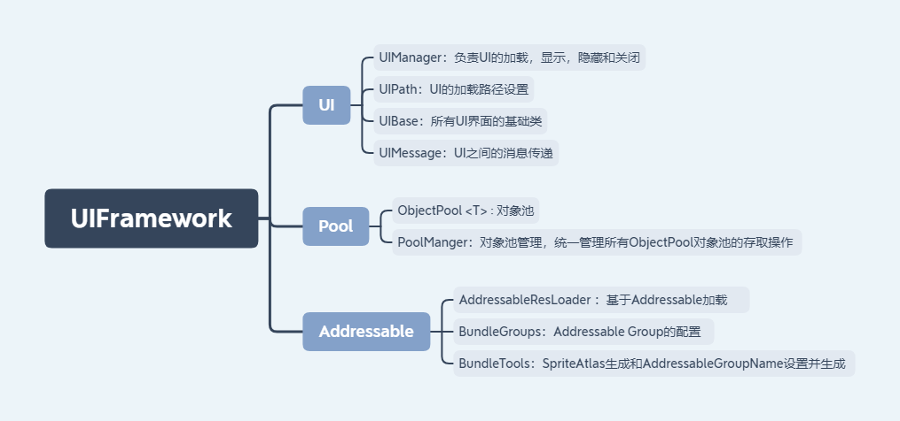
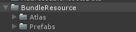
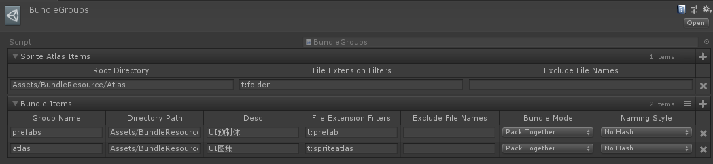
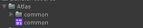
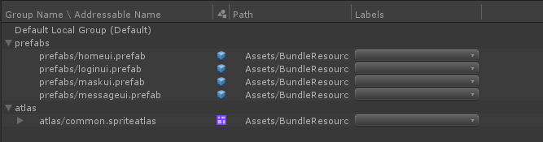

# UIFramework

UIFramework是基于Unity3D引擎 和UGUI实现的一个很简单的UI框架，现在可能不太成熟，但以后会慢慢修改更新框架。
## 主要的功能：
1.	UI界面的加载，显示，隐藏，关闭和界面内的消息传递。
2.	对象池功能，预制体的加载和重复利用。
3.  Addressable资源管理。

## 框架结构：

## 构造Addressable Assets
   1.	先把要打包的资源放在BundleResource文件夹下面 (可以自己选择文件夹，但是记得改BundleTools里面的打包路径）。
   
   
   2.	配置BundleGroup（右键 Create/ Bundles/BundleGroups.Asset），这个配置文件，就是AddressablesGroup的信息配置。
    
    
   3. 先生成SpriteAtlas，点击菜单栏BundleTools/ GenSpriteAtlas 会在目录下生成一个SpriteAtlas。
    
    
   4. 点击BundleTools/AssetBundle/SetAddressableGroupName 将生成对应的AddressablesGroup。
    
    
## 示范例子
   打开Launcher场景运行即可。
